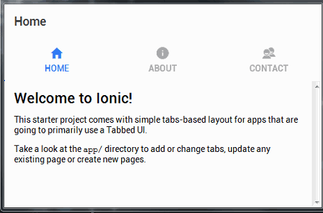

windionic
====
make a desktop application with `ionic`

Example
----


__C# Source Code__
```cs
[Export]
public class MyObject
{
    public static string func()
    {
        return "Hello World (This is a C# generated message)";
    }
}
```
__HTML__
```html
<ion-content padding class="about">
  {{ aboutMessage }}
</ion-content>
```
__TypeScript__
```typescript
/* ... */
constructor(private navCtrl: NavController) {
    // from `MyObject.d.ts` (auto-generated by windionic)
    this.aboutMessage = MyObject.func();
}
/* ... */
```